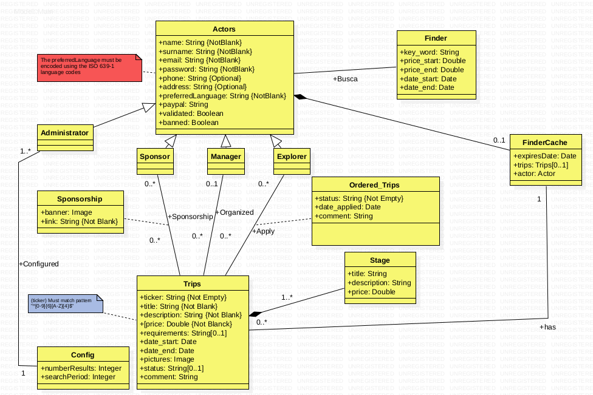

# TECLI1819ExplorerCodeJOH

## Enlace del proyecto en producción

- UI de la aplicación: https://acme-explorer-codejoh.herokuapp.com/
- UI de la API (Swagger): https://acme-explorer-codejoh.herokuapp.com/api-docs

## Enlace de la API

https://github.com/hector23rp/ACME-Explorer-CodeJOH

## Modelo conceptual UML

[uml.png](./UML/uml.png)

## Documentación

- [A+ de Entrega 1](./Documentacion/entrega1.md)